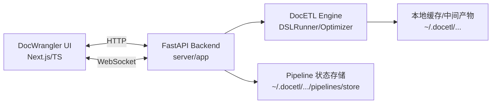

# 项目总览

## 1. 这是什么

本仓库包含两部分能力：

1) **DocETL（Python 包）**：声明式文档处理 pipeline（YAML/CLI/Python API），支持 LLM 驱动的 `map/reduce/resolve/filter/...` 等算子、缓存、成本统计、以及优化器（MOAR 等）。

2) **DocWrangler（Web Playground）**：用于交互式搭建与迭代 pipeline 的 IDE（Next.js + TypeScript），通过 FastAPI 后端执行 pipeline，并通过 WebSocket 回传实时日志与结果。

## 2. 高层组件与职责

### 2.1 DocETL（执行/优化）

- **输入**：pipeline 配置（通常是 YAML），包含 datasets、operations、steps、output，以及可选的 optimizer_config / system_prompt / llm_api_keys 等。
- **输出**：最终输出文件（JSON）+ 每个 operation 的中间结果（JSON，支持缓存复用）+ 控制台/进度信息。

### 2.2 FastAPI 后端（执行入口 + 持久化）

- 提供 pipeline 执行 API（HTTP + WebSocket）。
- 提供“工作区文件系统”能力（上传数据、写入 YAML、读取输出、分页读取、文档转换等）。
- 提供 pipeline “状态/元数据”持久化（面向 UI 的多个 pipeline 切换、保存、复制、删除）。

### 2.3 DocWrangler 前端（交互式编排）

- 管理 UI 侧 pipeline 状态（operations 列表、当前文件、输出路径、终端日志、优化进度等）。
- 将 UI 状态生成 DocETL YAML（`website/src/app/api/utils.ts:generatePipelineConfig`），写入后端本地文件系统，并通过 WebSocket 触发执行。
- 可选：提供“聊天/提示词改写”等 UI 辅助（独立的 `.env.local` API key；与 pipeline 执行 key 分离）。

## 3. 技术栈概览（以仓库实现为准）

- **Python**：`docetl/`（Typer CLI、Pydantic v2、LiteLLM、diskcache 等）
- **后端**：FastAPI + Uvicorn + WebSocket（`server/app/main.py`）
- **前端**：Next.js 14（App Router）+ React 18 + TypeScript + Tailwind/shadcn 组件
- **打包/运行**：Dockerfile + docker-compose；开发期 `make run-ui-dev`

