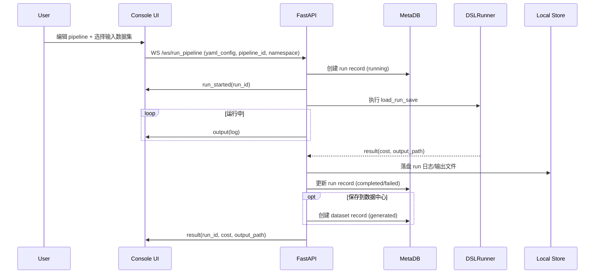
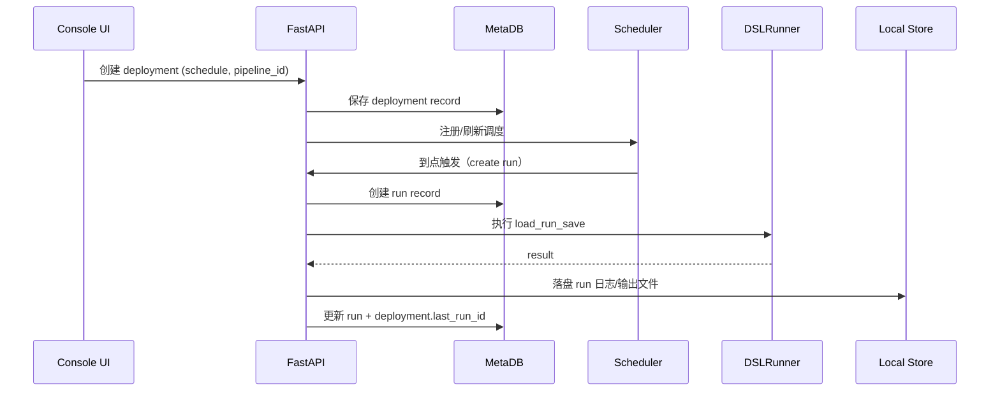

# 技术设计文档：平台（看板 / 执行 / 部署 / 数据中心）

- 版本：v0.1
- 日期：2025-12-18
- 适用范围：本仓库（`docetl/` + `server/app/` + `website/`）

## 1. 背景与目标

本平台基于现有 DocETL 执行引擎与 DocWrangler Playground，扩展为一个可“编排/执行/调度/沉淀数据”的流水线平台。用户登录后进入统一控制台，在授权范围内选择/切换命名空间（namespace），通过左侧菜单进入各业务页面：

- 看板：展示平台关键指标与运行健康度
- 执行：编辑并运行指定流水线，查看实时日志与结果
- 部署：为流水线创建调度计划，按时间自动执行
- 数据中心：管理用户上传数据与流水线生成数据（区分来源），并支持 Excel 上传解析
- 用户与权限：用户注册/登录/用户管理、权限控制（RBAC）、审计日志

### 1.1 设计目标（v1）

- 统一 UI 信息架构：左侧菜单 + 右侧内容区的控制台布局（参考需求截图）
- 支持用户注册、登录、用户管理与权限控制（RBAC）
- 以“命名空间（namespace）”隔离数据、流水线、运行与部署，并基于用户授权控制可见范围
- 审计日志：记录登录与关键操作，支持追溯与导出
- 补齐“运行记录 / 统计指标 / 调度能力 / 数据中心”四个核心缺口
- 尽量复用现有实现：FastAPI + WebSocket 执行链路、`/pipelines` 持久化、`~/.docetl/<namespace>/...` 存储约定

### 1.2 非目标（v1 不做或弱化）

- 企业级 IAM/SSO（OIDC/SAML）、细粒度 ABAC、复杂组织架构（可在 v2 演进）
- 分布式执行集群、弹性扩缩容、任务队列（v1 先保证单机可靠可用）
- 不对接外部“数据中心”系统（v1 仅提供平台内置的数据中心能力）

## 2. 现状与约束（基于仓库实现）

### 2.1 当前可复用能力

- **执行引擎**：`docetl/`（`DSLRunner` 支持 `load_run_save()` 与优化器）
- **后端**：`server/app/`（FastAPI）
  - WebSocket 执行：`/ws/run_pipeline/{client_id}`（实时输出/结果）
  - Pipeline CRUD：`/pipelines`（落盘 `~/.docetl/<namespace>/pipelines/store/*.json`）
  - 文件上传：`/fs/upload-file`（JSON/CSV -> JSON）
- **前端**：`website/`（Next.js/TS）
  - Playground：`website/src/app/playground/page.tsx`（编辑 pipeline、WebSocket 执行）

### 2.2 关键约束

- 当前存储以 **本地文件系统** 为主（`~/.docetl/<namespace>/...`），缺少数据库与鉴权体系；v1 需要新增“元数据数据库”（默认 SQLite，可切换 Postgres）承载用户/权限/审计/运行统计/调度持久化
- WebSocket 执行目前仅维护“最后一次运行状态”（`last_run_status`），缺少“运行历史”
- `upload-file` 仅支持 JSON/CSV；需求要求 Excel 上传与解析
- DocETL 当前数据加载（scan）会将输入整体读入内存；超大数据集需要在“数据中心导入策略/执行策略”层面做限制或分批处理

## 3. 需求解读（功能清单）

### 3.1 页面与导航

控制台整体布局：

- 左侧：Logo + 菜单（看板/执行/部署/数据中心/设置）
- 右侧：内容区随菜单切换

### 3.2 看板（Dashboard）

最小可用指标（可配置时间窗口，默认近 24h）：

- 平台承载流水线数（pipeline 数）
- 正在运行流水线数（running runs）
- 失败流水线数（failed runs）
- 平台累计运行次数（total runs）

### 3.3 执行（Execute）

- 在页面编辑流水线（复用现有 Playground 能力）
- 运行流水线并展示运行结果（实时日志、结果文件预览/下载）
- 与平台内置“数据中心”联动：
  - 输入数据可从数据中心选择
  - 运行输出可保存/登记到数据中心（形成生成数据集）

### 3.4 部署（Deployments）

- 为流水线创建调度：指定何时执行（cron/固定间隔/一次性）
- 支持启停、手动触发、查看最近运行记录

### 3.5 数据中心（Data Center）

- 承载原平台数据迁移与日常上传
- 区分两类数据：
  - 用户上传（user-uploaded）
  - 流水线生成（pipeline-generated）
- 支持 Excel 上传与解析（sheet/header/类型处理/行数限制/预览）

### 3.6 用户与权限（Auth/RBAC/Audit）

- 用户注册、登录、退出、密码重置/修改
- 用户管理：管理员可创建/禁用/重置密码、查看用户状态
- 权限管理：基于角色的访问控制（RBAC），控制“页面可见 + API 可用 + 资源读写”
- 审计日志：记录登录事件与关键资源操作（创建/更新/删除/触发执行/创建部署/上传数据等）

## 4. 总体方案（架构与模块）

### 4.1 目标架构

```mermaid
flowchart LR
  UI["Console UI (Next.js/TS)"] <--> |HTTP| API["FastAPI (server/app)"]
  UI <--> |WebSocket| API
  API --> MetaDB[(Metadata DB (SQLite/Postgres))]
  API --> Runner["DocETL Runner (DSLRunner)"]
  API --> Store[(Artifact Store (~/.docetl/{namespace}))]
  API --> Scheduler["Scheduler (persisted jobs)"]
  Scheduler --> MetaDB
  Scheduler --> Runner
```

### 4.2 模块拆分

- **Console UI（website）**
  - 统一布局（Sidebar + Content）
  - 页面：Dashboard / Execute / Deployments / Data Center / Settings
- **Backend API（server/app）**
  - auth：认证（注册/登录/JWT/刷新）、RBAC 校验
  - audit：审计日志写入与查询
  - runs：运行记录管理（list/get/metrics/cancel）
  - deployments：调度定义与执行触发（CRUD + enable/disable + trigger）
  - data-center：数据集登记、上传与预览（含 Excel 解析）
  - pipeline：复用现有 WebSocket 执行链路，但补齐 run_id & run record
- **Metadata DB（v1 新增）**
  - 用户、角色/授权、审计日志、部署调度、运行记录与指标聚合
- **Artifact Store（本地落盘，v1）**
  - 继续使用 `~/.docetl/<namespace>/...` 保存大对象（输出、日志、上传文件、中间产物）
  - 兼容现有 pipeline store（逐步迁移到 DB）
- **Scheduler（v1：持久化调度）**
  - 支持重启后恢复 deployments；提供补跑/重试/并发控制（细节见调度语义章节）

## 5. 信息架构与前端路由规划

### 5.1 左侧菜单（建议）

- 看板：`/console/dashboard`
- 执行：`/console/execute`
- 部署：`/console/deployments`
- 数据中心：`/console/data-center`
- 设置：`/console/settings`

> 兼容性建议：保留原 `website/src/app/playground` 路由，`/console/execute` 可复用其组件并逐步迁移。

### 5.2 关键交互（v1）

- Dashboard：卡片指标 + 最近运行列表
- Execute：
  - 选择/创建 pipeline（复用 pipeline store）
  - 选择输入数据集（来自 Data Center）
  - 运行（WebSocket）+ 结果预览 + “保存到数据中心”
- Deployments：
  - 新建部署：选择 pipeline + 选择 schedule + 配置输入数据集（可选）
  - 列表：状态、下一次运行时间、最近一次运行结果
- Data Center：
  - 数据集列表：来源筛选（用户上传/流水线生成）
  - 上传：JSON/CSV/Excel
  - 预览：分页查看（与现有 read-file-page 设计一致）

## 6. 数据模型（v1）

> 说明：v1 引入“元数据数据库”（默认 SQLite）承载用户/权限/审计/运行/调度/数据集登记；文件系统继续保存大对象（输出文件、日志、上传文件等）。现有 JSON pipeline store 可作为兼容层，逐步迁移到 DB。

### 6.1 Pipeline（已存在，补充约定）

存储：`~/.docetl/<namespace>/pipelines/store/<pipeline_id>.json`

现有字段（摘录）：`id/name/namespace/description/state/created_at/updated_at/last_run_status/last_run_at`

v1 补充约定：

- `pipeline.name` 用于生成默认输出路径：`~/.docetl/<namespace>/pipelines/outputs/<pipeline_name>.json`
- `pipeline.state` 仍是 UI snapshot，不直接等同于 YAML（保持现状）

### 6.2 Run（新增）

Run 用于承载“每次执行”的可查询历史，覆盖手动执行与部署触发执行。

| 字段 | 类型 | 说明 |
|---|---|---|
| id | string(uuid) | run_id |
| namespace | string | 命名空间 |
| pipeline_id | string | pipeline 标识 |
| pipeline_name | string | 冗余字段，便于列表展示 |
| trigger | enum | `manual` / `deployment` |
| deployment_id | string\|null | 部署触发时关联 |
| scheduled_for | datetime\|null | 调度计划点（仅 deployment 触发；用于幂等去重） |
| status | enum | `queued/running/completed/failed/cancelled` |
| created_at | datetime | 创建时间 |
| started_at | datetime\|null | 开始执行时间 |
| ended_at | datetime\|null | 结束执行时间 |
| triggered_by_user_id | string\|null | 触发人（手动触发时有值） |
| cost | number\|null | DocETL cost（如可获得） |
| output_path | string\|null | 结果文件路径（JSON） |
| log_path | string\|null | 日志落盘路径（文本） |
| error | string\|null | 失败错误摘要（可截断） |
| metadata | object | 扩展字段：模型、参数、输入数据集等 |
| attempt | int | 第几次尝试（重试时递增，默认 1） |
| max_attempts | int\|null | 最大尝试次数（来自 deployment 重试策略） |

存储建议：

- 元数据：Metadata DB（`runs` 表）
- 日志：`~/.docetl/<namespace>/runs/logs/<run_id>.log`（可设置 TTL/归档策略）

### 6.3 Deployment（新增）

Deployment 用于描述“对某条 pipeline 的调度配置”。

| 字段 | 类型 | 说明 |
|---|---|---|
| id | string(uuid) | deployment_id |
| namespace | string | 命名空间 |
| name | string | 部署名称（namespace 内唯一） |
| pipeline_id | string | 绑定 pipeline |
| enabled | boolean | 是否启用 |
| schedule_type | enum | `cron/interval/once` |
| schedule | object | 见下方 |
| timezone | string | IANA TZ，如 `Asia/Shanghai` |
| input_dataset_id | string\|null | 默认输入（可选） |
| output_to_data_center | boolean | 输出是否登记为生成数据集 |
| output_dataset_name_tpl | string\|null | 输出数据集命名模板（如 `{{pipeline_name}}_{{date}}`） |
| misfire_policy | enum | `skip/run_once/catch_up` |
| max_catchup_runs | int\|null | catch_up 最大补跑次数 |
| retry_policy | object\|null | `{max_attempts, backoff, retry_on}` |
| concurrency_policy | object\|null | `{namespace_max, pipeline_max, on_conflict}` |
| last_run_id | string\|null | 最近一次 run |
| next_run_at | datetime\|null | 便于 UI 展示（可由 scheduler 计算/刷新） |
| created_at | datetime | 创建时间 |
| updated_at | datetime | 更新时间 |

schedule 字段建议：

- cron：`{ "cron": "0 8 * * *" }`
- interval：`{ "every": 15, "unit": "minutes" }`
- once：`{ "run_at": "2025-12-31T10:00:00+08:00" }`

存储：Metadata DB（`deployments` 表）

### 6.4 Dataset（数据中心，新增）

Dataset 用于登记一份可复用的数据集（用户上传/流水线生成），提供来源区分与血缘。

| 字段 | 类型 | 说明 |
|---|---|---|
| id | string(uuid) | dataset_id |
| namespace | string | 命名空间 |
| name | string | 展示名（namespace 内唯一或允许重名+版本） |
| source | enum | `user_upload` / `pipeline_generated` |
| format | enum | `json`（v1 内部统一为 JSON） |
| original_format | enum\|null | `json/csv/xlsx/xls` |
| raw_path | string\|null | 原始文件路径（xlsx/xls/csv/json） |
| path | string | 可执行数据路径（normalized，JSON/CSV） |
| ingest_status | enum | `pending/processing/ready/failed` |
| ingest_config | object\|null | `{sheet_name, header_row, range, ...}` |
| created_at | datetime | 创建时间 |
| updated_at | datetime | 更新时间 |
| schema | object\|null | 可选：字段列表、类型推断、样例等 |
| row_count | number\|null | 可选：行数 |
| lineage | object\|null | 生成数据血缘：pipeline_id/run_id/output_path 等 |
| tags | string[] | 标签 |
| description | string\|null | 描述 |

存储建议：

- 元数据：Metadata DB（`datasets` 表）
- 文件：
  - 原始文件：`~/.docetl/<namespace>/data_center/raw/<dataset_id>/*`
  - 用户上传（normalized）：`~/.docetl/<namespace>/data_center/datasets/user/<dataset_id>.json`
  - 流水线生成（normalized）：`~/.docetl/<namespace>/data_center/datasets/generated/<dataset_id>.json`

> 兼容性：现有 `~/.docetl/<namespace>/files/*.json` 可在迁移期视为“用户上传数据”，逐步导入 registry（不强制一次性搬迁）。

## 7. 存储结构（v1 目录约定）

```text
~/.docetl/
  _platform/
    platform.db            # 新增：元数据数据库（默认 SQLite，可配置为 Postgres）
~/.docetl/<namespace>/
  pipelines/
    store/                # 已存在：pipeline record
    configs/              # 已存在：yaml configs
    outputs/              # 已存在：pipeline output json
    <pipeline_name>/
      intermediates/      # 已存在：中间产物
  runs/
    logs/                 # 新增：run 日志
  data_center/
    raw/                  # 新增：原始上传文件（xlsx/xls/csv/json）
    datasets/
      user/               # 新增：用户上传数据（统一 JSON）
      generated/          # 新增：流水线生成数据（统一 JSON）
  documents/              # 已存在：文档上传
  files/                  # 已存在：历史数据上传目录（迁移期兼容）
```

## 8. 后端设计（FastAPI）

### 8.1 路由划分（建议新增）

- `GET /health`（已存在）
- **新增** `POST /auth/register` / `POST /auth/login` / `POST /auth/logout` / `POST /auth/refresh` / `GET /auth/me`
- **新增** `GET/POST/PUT/... /users`（管理员用户管理）
- **新增** `GET /audit-logs`（审计日志查询/导出）
- `POST /run_pipeline`（已存在，保留）
- `WS /ws/run_pipeline/{client_id}`（已存在，建议扩展 run 记录）
- `GET/POST/PUT/... /pipelines`（已存在）
- **新增** `GET /runs` / `GET /runs/{run_id}` / `POST /runs/{run_id}/cancel`
- **新增** `GET/POST/PUT/... /deployments`
- **新增** `GET/POST/... /data-center/datasets`
- **新增** `GET /metrics/summary` / `GET /metrics/timeseries` / `GET /metrics/breakdown`

> 前端仍可通过 Next Route Handlers 代理这些 API，保持浏览器同源策略与部署一致性。

### 8.2 执行链路改造（补齐 Run）

#### 8.2.1 手动执行（WebSocket）

输入（首条消息）扩展建议：

```json
{
  "namespace": "xxx",
  "pipeline_id": "uuid",
  "yaml_config": "...",
  "trigger": "manual",
  "input_dataset_id": "uuid (optional)",
  "save_output_to_data_center": true
}
```

后端行为：

1) 创建 run record（status=queued -> running），生成 `run_id`
2) 向客户端发送 `type=run_started`（携带 run_id）
3) 按现有逻辑执行并周期推送 `type=output`
4) 结束后写入 run record：status、cost、output_path、error、ended_at
5) 若配置 `save_output_to_data_center=true`，登记生成数据集（dataset）

#### 8.2.2 部署触发执行（Scheduler）

调度触发时复用同一执行函数（与 WebSocket 执行共享）：

- 触发器构造 `RunCreate{ trigger=deployment, deployment_id, ... }`
- 执行完成后更新 deployment 的 `last_run_id/next_run_at`

### 8.3 Scheduler（v1：持久化调度 + 健壮性语义）

v1 的调度需要满足“平台健壮性与可用性”的基本诉求：重启可恢复、支持补跑（misfire）、支持重试、可控并发、可追溯。

#### 8.3.1 实现形态（建议）

- Scheduler 作为后端的后台任务运行（可在 v2 拆为独立进程/服务）
- 调度定义以 Deployment 存储在 Metadata DB（启用/停用、schedule、timezone、策略）
- Scheduler 启动时从 DB 加载所有 `enabled=true` 的 deployments，持续计算 `next_run_at` 并触发执行
- 触发执行时统一走“创建 Run -> 执行 -> 更新 Run/Deployment”的通用执行函数（与手动执行复用）

> 技术选型建议：可用 `APScheduler(AsyncIOScheduler) + SQLAlchemyJobStore` 实现持久化 job 与 misfire；或使用“自研循环 + croniter + DB 锁”实现（以 DB 为真源）。

#### 8.3.2 调度语义（建议默认）

- **时区**：每个 deployment 配置 `timezone`（默认 `Asia/Shanghai`），所有 next_run_at 基于该时区计算
- **misfire（错过窗口）处理**：当服务停机或阻塞导致错过触发时间，提供策略：
  - `skip`：跳过所有错过窗口，直接计算下一次
  - `run_once`：错过期间只补跑一次（按“最近一次错过的 scheduled_for”）
  - `catch_up`：按错过的每个 scheduled_for 补跑（需 `max_catchup_runs` 限制）
- **幂等/去重**：Run 增加 `scheduled_for` 字段，且对 `(deployment_id, scheduled_for)` 建唯一约束，确保同一计划点最多创建一次 run
- **并发策略**（建议按 deployment 可配，默认保守）：
  - `concurrency_namespace_max`：同 namespace 最大并发 run 数
  - `concurrency_pipeline_max`：同 pipeline 最大并发 run 数
  - `on_conflict`：`queue`/`skip`/`replace`（replace = 取消旧 run 再启动新 run）
- **重试策略**（建议按 deployment 可配）：
  - `max_attempts`（如 3）
  - `backoff`（指数退避 + jitter）
  - `retry_on`（仅对可重试错误：超时、网络、限流；非业务错误不重试）
- **告警**（v1 可先落审计/运行事件，v2 接入告警通道）：
  - 连续失败 N 次触发告警事件（邮件/IM/Webhook 由后续接入）

### 8.4 Data Center（Excel 上传与解析）

#### 8.4.1 上传入口（建议）

- `POST /data-center/datasets/upload`
  - multipart：`file` + `namespace` + `name?` + `source=user_upload`
  - 可选参数：`sheet_name?` / `header_row?` / `start_row?` / `end_row?` / `preview_only?`
  - 支持：`.json/.csv/.xlsx/.xls`
  - 上传后先落“原始文件（raw）”，再异步解析生成“可执行数据（normalized）”，并更新 dataset 状态

建议新增 ingest 状态字段（dataset）：

- `ingest_status`: `pending/processing/ready/failed`
- `ingest_config`: `{sheet_name, header_row, range, ...}`
- `error`: 失败原因摘要

#### 8.4.2 解析策略（面向“不固定 Excel”）

- Excel：
  - UI 侧提供“预览 + 配置”：
    - 选择 sheet（或默认第一个）
    - 选择表头行（或自动探测：第一行非空且字段名重复率低）
    - 可选：导入行范围（用于超大文件先按范围导入）
  - 后端解析建议：
    - 使用 `openpyxl` 的 `read_only=True` 流式读取（避免一次性加载整表）
    - 对日期/数字/空值做统一序列化（日期输出 ISO 字符串）
    - 生成 `schema/row_count/sample_rows` 用于 UI 展示
  - 空值统一为 `null`
  - 数值/日期按常见规则序列化（日期输出 ISO 字符串）
- CSV：
  - 与现有一致，`DictReader` 转 JSON
- JSON：
  - 要求为数组（list[object]）或可配置兼容对象（由实现决定）

#### 8.4.3 大文件与限额（建议）

- 原始文件与解析产物分离存储：保留 raw 以便追溯；normalized 用于执行与预览
- 对超大文件提供两种模式：
  - `preview_only=true`：只读取前 N 行生成预览与 schema，不做全量落盘（快速确认解析规则）
  - 全量导入：后台任务解析，UI 轮询状态

安全与限额（建议默认，可配置）：

- 文件大小限制（如 50MB，可配置）
- 最大行数/列数限制（如 200k 行、200 列，超过需提示用户）
- 解析失败返回可读错误（sheet 不存在、编码错误、结构不合法等）

> 注意：DocETL 当前 `scan` 会将输入整体读入内存（见 `docetl/operations/scan.py` + `docetl/dataset.py`），因此“超大数据集全量执行”可能受限于运行机器内存。v1 建议在执行页提供“样本运行/按范围导入”的工作流；若必须支持超大数据集全量执行，需要在 v2 引入分片数据集/流式读取/分批执行与汇总机制。

### 8.5 Dashboard Metrics（建议计算口径）

指标不确定时，建议采用“可扩展指标集 + 默认视图”的实现：先提供一组通用指标与维度，并允许后续按需要扩展/开关。

#### 8.5.1 默认指标（建议）

以 `namespace + 时间窗口(window)` 为基本过滤条件：

- 规模：pipeline_count、deployment_count、dataset_count
- 运行：run_total、run_running、run_failed、run_success、success_rate
- 性能：avg_duration、p95_duration（可选）、avg_cost（若可获得）
- 调度：misfire_count、retry_count（依赖调度语义落事件）
- 错误：top_error_types/top_error_messages（摘要聚类可后置）

#### 8.5.2 API 形态（建议）

- `GET /metrics/summary?namespace=<ns>&window=24h`
  - 返回卡片指标（counts/ratios）
- `GET /metrics/timeseries?namespace=<ns>&window=7d&metric=run_total&interval=1h&group_by=status`
  - 返回趋势图数据（按小时/天分桶）
- `GET /metrics/breakdown?namespace=<ns>&window=24h&dimension=pipeline&metric=run_failed&limit=20`
  - 返回 TopN/分组统计（按 pipeline/deployment/user/status 等）

实现建议：

- 以 Metadata DB 中的 `runs/deployments/datasets/audit_logs` 为数据源
- 复杂指标可做按小时聚合表（减少扫描成本）

## 9. 数据中心实现（不对接外部系统）

本项目不需要对接外部数据中心系统；“数据中心”即平台内置的数据集管理能力：

- 数据集元数据：存 Metadata DB（datasets 表）
- 原始文件与解析产物：落盘到 `~/.docetl/<namespace>/data_center/...`（raw + normalized）
- 执行联动：执行页从数据中心选择输入；执行输出可登记为 generated dataset（带血缘）

## 10. 认证与权限（关于“登入”）

v1 需要支持用户管理、权限控制与审计日志。推荐采用“JWT + RBAC + 审计事件”方案，并以 namespace 作为资源隔离边界。

### 10.1 认证（Authentication）

- 登录方式：用户名/邮箱 + 密码（可扩展手机号/SSO）
- 密码存储：强哈希（bcrypt/argon2）+ 随机盐；不落明文
- Token：
  - access token：短时效（如 15min）
  - refresh token：长时效（如 7~30d），支持撤销（服务端存储/黑名单）
- 安全策略：
  - 登录失败限流（按账号/IP），可选验证码
  - 敏感操作（改密/重置）强制二次校验（可选）

### 10.2 授权（Authorization / RBAC）

授权模型建议（可按实际裁剪）：

- 平台角色：`platform_admin`（可管理所有用户/namespace）
- 命名空间角色：`namespace_admin` / `editor` / `viewer`
  - `namespace_admin`：用户授权、流水线/部署/数据中心全权限
  - `editor`：可编辑与执行、可创建部署、可上传数据
  - `viewer`：只读（可查看看板/运行/数据集，不可执行或仅可手动执行视业务而定）

后端强制要求：

- 任何带 namespace 的资源访问必须校验：`user ∈ namespace` 且具备对应权限
- 前端“菜单可见性”仅作体验优化，最终以后端鉴权为准

### 10.3 审计日志（Audit Log）

审计事件建议包含：

- 登录/退出/刷新 token、登录失败
- 用户管理：创建/禁用/重置密码/修改角色
- 资源变更：pipeline/deployment/dataset 的创建/更新/删除
- 执行相关：手动触发 run、取消 run、部署触发 run

审计字段建议：

- `id, occurred_at, actor_user_id, actor_username, action, resource_type, resource_id, namespace, success, ip, user_agent, request_id, detail(before/after摘要)`

## 11. 关键流程（时序）

### 11.1 手动执行（Execute）



### 11.2 调度执行（Deployments）



## 12. 可观测性与运维

- 日志：后端结构化日志（run_id/pipeline_id/namespace 作为关键字段）
- 运行日志落盘：便于事后审计与 UI 查看
- 关键指标：run 成功率、平均耗时、失败原因 TopN（v1 可先做基础计数）
- 健康检查：保持 `GET /health`，新增 scheduler 状态（可选）

### 12.1 容量与性能预估（基于当前业务量）

已知业务量（你提供的目标）：

- 用户规模：约 100 人；同时操作一般 ≤ 10 人
- 执行规模：2~3 条流水线同时运行
- 单条流水线输入：约 3000 行 Excel
- LLM 调用：每行 1~2 次（约 3000~6000 次请求/流水线/次）

结论与建议（偏“不过度企业化”的配置）：

- **主要瓶颈是 LLM 速率限制与稳定性**，不是 Web 并发；需要做全局限流/并发控制与排队
- **执行并发建议**：同一时间最多运行 2 条流水线，第三条排队（可配置）；避免 3 条同时把 LLM 配额打满导致全失败
- **LLM 并发建议**：从全局并发 5~10 开始压测（按供应商 rate limit 调整）；必要时按模型/账号做独立限流
- **优先减少请求数**：尽量把“每行 1~2 次”合并为 1 次；或使用 `batch_prompt` 做批量（如 10~20 行/次），将 3000~6000 次请求降到 150~600 次量级（视可批量的业务逻辑而定）
- **日志推送要增量**：当前 WebSocket 若反复发送全量日志缓冲，会随着 3000 行处理而变得非常大，必须改为“增量/按块”推送并限制单条消息大小
- **单机资源建议**：以“网络 IO + 少量 CPU 解析”为主，8 vCPU / 16~32GB 内存通常够用；磁盘按日志与产物保留策略预留（建议 TTL/归档）

## 13. 测试策略（建议）

- 后端：
  - DB 模型/DAO 单测：users/roles/memberships、runs/deployments/datasets、audit_logs（CRUD、并发、唯一约束）
  - 解析单测：CSV/Excel/JSON 的合法/非法样例
  - Scheduler 语义单测：misfire/catch_up、重试、并发冲突策略、幂等去重（deployment_id + scheduled_for）
  - API 冒烟：`tests/basic` 增加 auth/rbac、runs/deployments/data-center 基本流程（可跳过真实 LLM 调用）
- 前端：
  - 关键页面渲染与路由测试（如已有框架）
  - E2E（可选）：创建 pipeline -> 上传数据集 -> 执行 -> 在 runs 列表可见

## 14. 待确认事项（需要产品/业务补齐）

1) 是否需要对接企业 SSO（OIDC/SAML）？若需要，优先级与账号来源（本地账号/统一身份）如何？
2) 权限粒度：仅到 namespace 级别，还是需要细到 pipeline/dataset/deployment？（会显著影响模型与 UI）
3) Excel 导入：最大文件大小/行列规模、是否必须支持多 sheet 选择、是否需要“仅导入指定 sheet/范围/表头行”配置
4) 调度语义：补跑策略（misfire）、重试次数/退避、并发策略（同 pipeline 同时最多几次）、失败告警渠道
5) 看板指标：默认时间窗口与指标集合（按 pipeline/按部署/按用户/按错误类型/按成本），以及哪些需要趋势图
