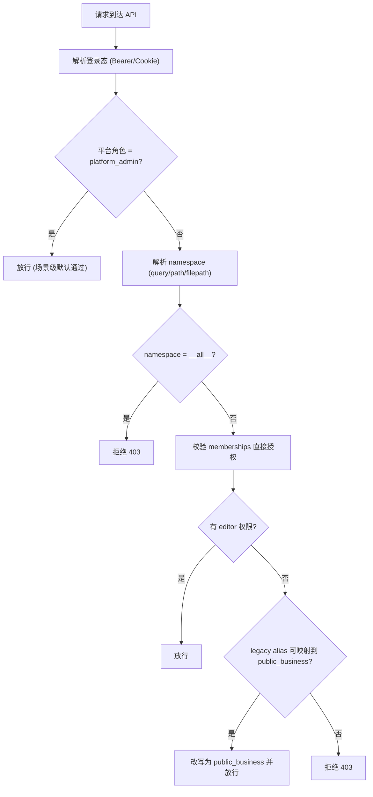

# 业务场景隔离 RBAC 设计文档（当前实现）

## 1. 文档信息

- 状态：`Implemented`（与当前代码一致）
- 适用范围：`server/app`、`website/src/app/console`
- 核心隔离键：`namespace`（同时作为“业务场景”技术主键）
- 默认业务场景：`public_business`（展示名：`公共业务`）

## 2. 背景与目标

当前平台采用“平台级 + 业务场景级”两层权限控制：

- 平台级角色控制“是否可进行平台管理动作”
- 业务场景级角色控制“在某个 namespace 内可读写哪些业务数据”

本轮实现目标：

1. 统一业务场景与 namespace，不引入第二套隔离 ID。
2. 所有新用户默认加入 `public_business`。
3. 历史用户命名空间与历史数据迁移到 `public_business`。
4. 管理员支持 `namespace=__all__` 聚合读取（仅查询接口）。
5. 取消分组参与鉴权链路，场景用户授权统一为 `editor`。
6. 模型资源池升级为平台全局资源，普通用户只读、管理员可写。

## 3. 术语

- `platform_role`：平台角色，保存在 `users.platform_role`。
- `namespace`：业务场景唯一标识（slug），用于存储与鉴权。
- `display_name`：业务场景展示名（中文），保存在 `namespace_catalog.display_name`。
- `membership`：用户在某场景中的直接授权，保存在 `memberships`。
- `__all__`：管理员聚合读取哨兵值，不对应真实 namespace。

## 4. 权限模型

### 4.1 平台角色

- `platform_admin`
- `user`

### 4.2 场景角色（数据模型保留）

数据模型保留三种值：

- `viewer`
- `editor`
- `namespace_admin`

但当前实现中，用户侧实际只发放 `editor`：

- `upsert_membership(...)` 固定写入 `editor`
- 启动时 `_normalize_membership_roles_to_editor(...)` 会把历史非 `editor` 角色归一化为 `editor`
- 管理端场景授权不再提供角色下拉框

### 4.3 权限矩阵（当前行为）

| 能力 | 普通用户（已授权场景） | 平台管理员 |
|---|---|---|
| 查看 runs/deployments/datasets/pipelines | 是（仅当前场景） | 是（任意场景，支持 `__all__`） |
| 执行/创建/更新业务对象 | 是（仅当前场景） | 是（任意场景） |
| 删除业务对象 | 是（仅当前场景） | 是（任意场景） |
| 创建/编辑业务场景 | 否 | 是 |
| 场景用户授权管理 | 否 | 是 |
| 模型资源池读取 | 是（全局） | 是（全局） |
| 模型资源池增删改 | 否 | 是 |

## 5. 判权规则

### 5.1 基础规则

实现位于：`/Users/husihang/Documents/docetl_codex/server/app/security.py`

1. `platform_admin` 在 `assert_namespace_role(...)` 中直接放行。
2. 非管理员仅检查 `memberships` 直接授权（不再合并分组角色）。
3. 若 `namespace_catalog.is_active=0`，返回 `403 Namespace is inactive`。
4. `min_role` 校验仍存在（`viewer < editor < namespace_admin`），但当前用户授权角色统一为 `editor`。

### 5.2 `__all__` 聚合读取

- `resolve_namespace_for_read(...)` 对 `namespace=__all__` 的处理：
  - 仅 `platform_admin` 可用，返回 `None` 作为“不过滤 namespace”信号
  - 普通用户返回 `403 No access to all namespaces`
- 仅查询路由接入该逻辑；写路由仍要求显式具体 namespace。

### 5.3 历史兼容别名（legacy namespace）

- 针对“用户名同名老 namespace”兼容：
  - 如果用户访问 `namespace=<username>` 且对 `public_business` 有权限，自动映射到 `public_business`
  - 用于缓解历史前端缓存和老链接导致的 403
- 文件系统路径也支持同样别名映射：
  - 访问 `~/.docetl/<username>/...` 时按规则映射到 `~/.docetl/public_business/...`

## 6. 数据模型与存储设计

实现位于：`/Users/husihang/Documents/docetl_codex/server/app/storage/metadata_db.py`

### 6.1 关键表

- `users`：用户主体与 `platform_role`
- `namespace_catalog`：业务场景目录
  - `namespace`（PK）
  - `display_name`（UNIQUE）
  - `description`
  - `is_active`
  - `created_by_user_id`
  - `created_at`, `updated_at`
- `memberships`：用户-场景授权（当前 role 统一为 `editor`）
- `runs` / `deployments` / `datasets`：业务数据主体（按 `namespace` 隔离）
- `model_registry`：全局模型资源池
- `audit_logs`：审计日志

### 6.2 兼容保留（未启用）

- `groups` / `group_memberships` / `group_namespace_roles` 表仍保留在 schema。
- 但 API 路由未挂载，分组不参与现网鉴权决策链路。

## 7. 初始化与迁移策略

`init_schema(...)` 启动阶段执行四步：

1. `_backfill_namespace_catalog(...)`
2. `_ensure_default_public_business_namespace(...)`
3. `_migrate_legacy_namespaces_to_public_business(...)`
4. `_normalize_membership_roles_to_editor(...)`

### 7.1 历史 namespace 迁移核心动作

1. 把旧 namespace 文件树合并到 `public_business`。
2. 规范化 pipeline store 中嵌套字段：
   - `namespace` 字段改为 `public_business`
   - 路径中的 `/.docetl/<legacy>/` 改为 `/.docetl/public_business/`
3. 用户授权合并到 `public_business`。
4. `runs/deployments/datasets/audit_logs` 的 `namespace` 列统一重写。
5. `runs/datasets` 中路径字段重写到 `public_business`。
6. 删除旧 namespace 的 `namespace_catalog` 记录。
7. 运行期兜底：pipeline store 在读写时也会归一化旧 namespace/path（防止旧快照残留）。

### 7.2 新用户默认场景

`/auth/register` 会自动：

- 确保 `public_business` 场景存在
- 写入 `memberships(user_id, public_business, editor)`

## 8. API 设计（RBAC 相关）

### 8.1 场景管理 API

实现位于：`/Users/husihang/Documents/docetl_codex/server/app/routes/scenarios.py`

- `GET /scenarios/mine`：当前用户可访问场景列表
- `GET /scenarios`：管理员查看全部场景
- `POST /scenarios`：管理员创建场景（中文名 -> slug）
- `PATCH /scenarios/{namespace}`：管理员更新元数据/启停
- `GET /scenarios/{namespace}/users`：管理员查看场景授权用户
- `PUT /scenarios/{namespace}/users/{user_id}`：管理员授权用户（固定 `editor`）
- `DELETE /scenarios/{namespace}/users/{user_id}`：管理员移除用户授权

### 8.2 用户与授权 API

实现位于：`/Users/husihang/Documents/docetl_codex/server/app/routes/users.py`

- `PUT /users/{user_id}/namespaces/{namespace}`：管理员写入场景授权（固定 `editor`）
- `GET /users/{user_id}/memberships`：管理员查看用户场景授权
- `GET /auth/me`：返回 `memberships`，含 `display_name`

### 8.3 业务查询 API 的 `__all__`

通过 `resolve_namespace_for_read(...)` 接入：

- `GET /runs`
- `GET /runs/summary`
- `GET /deployments`
- `GET /pipelines`
- `GET /data-center/datasets`

写接口要求具体 namespace，`__all__` 不可用。

### 8.4 文件系统访问鉴权

实现位于：`/Users/husihang/Documents/docetl_codex/server/app/routes/filesystem.py`

- 路径必须位于 `~/.docetl/<namespace>/...`
- `_` 前缀内部 namespace（例如 `_platform`）禁止访问
- 读取前进行 namespace 角色检查
- 支持 legacy 用户 namespace 到 `public_business` 的路径别名映射

### 8.5 模型资源池 API

实现位于：`/Users/husihang/Documents/docetl_codex/server/app/routes/model_registry.py`

- `GET /models`：所有登录用户可读（普通用户默认仅 active）
- `include_inactive=true`：仅管理员可用
- `POST/PATCH/DELETE /models...`：仅管理员

## 9. 前端交互与状态管理

### 9.1 场景选择器

实现位于：`/Users/husihang/Documents/docetl_codex/website/src/app/console/settings/page.tsx`

- 普通用户加载 `GET /scenarios/mine`
- 管理员加载 `GET /scenarios`，并增加固定项“全部业务场景（`__all__`）”
- 选择结果写入 `localStorage.docetl_namespace`
- 切换时清理非鉴权缓存并重载页面，避免旧场景快照污染

### 9.2 管理后台

实现位于：`/Users/husihang/Documents/docetl_codex/website/src/app/console/admin/page.tsx`

- 场景授权只保留“用户分配/移除”
- 授权角色固定 `editor`（无角色下拉框）
- 分组管理入口已移除

### 9.3 模型资源池页面

实现位于：`/Users/husihang/Documents/docetl_codex/website/src/app/console/models/page.tsx`

- 普通用户：仅查看/测试
- 管理员：可新增、编辑、删除

## 10. 审计与安全

- 关键管理动作均写入 `audit_logs`（用户、场景、模型、运行等）
- 会话 token 按 HMAC 哈希存储（`sessions.token_hash`）
- 禁止停用/降级最后一个活跃平台管理员（用户更新接口有保护）

## 11. 关键时序（判权）

## 12. 测试与验收映射

已覆盖的关键测试：

- `tests/server/app/test_auth_rbac_audit.py`
  - 注册默认加入 `public_business`
  - 普通用户无管理员权限
  - 最后一个管理员保护
- `tests/server/app/test_scenarios_models_and_all_namespace.py`
  - 场景 API 与 display_name
  - `__all__` 管理员可读、普通用户拒绝
  - 模型资源池读写 RBAC
  - 旧 namespace 迁移到 `public_business`
- `tests/server/app/test_groups_api.py`
  - 分组与场景分组授权接口为 `404`（未启用）
- `tests/server/app/test_pipeline_fs_rbac.py`
  - 文件路径按 namespace 鉴权
  - legacy 路径别名兼容
  - pipeline store 旧 namespace 归一化
- `tests/server/app/test_data_center_upload.py`
  - `namespace=<username>` 读取兼容映射至 `public_business`

## 13. 已知限制与后续建议

1. `NamespaceRole` 枚举仍包含 `viewer/namespace_admin`，但当前业务只发放 `editor`。
2. 分组相关表仍在 schema（为历史兼容），可在后续版本评估清理策略。
3. `__all__` 属于查询特性，建议持续控制在只读列表/汇总接口，避免误扩散到写接口。
4. 若后续要恢复细粒度角色，建议先引入能力矩阵（action-based），再开放多角色发放。
